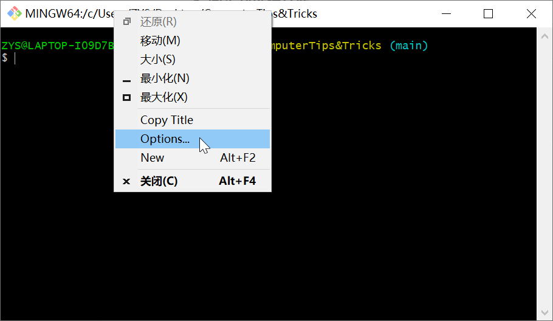
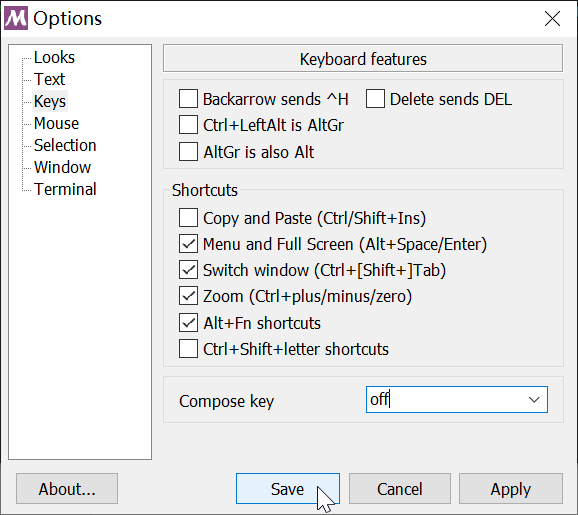
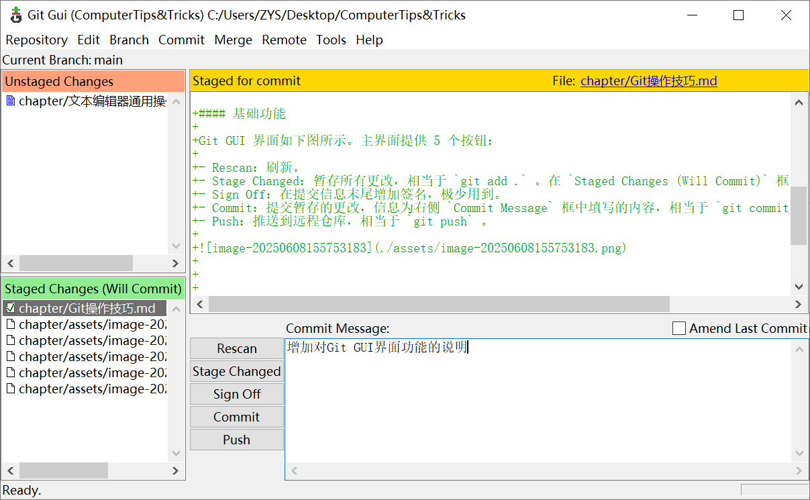
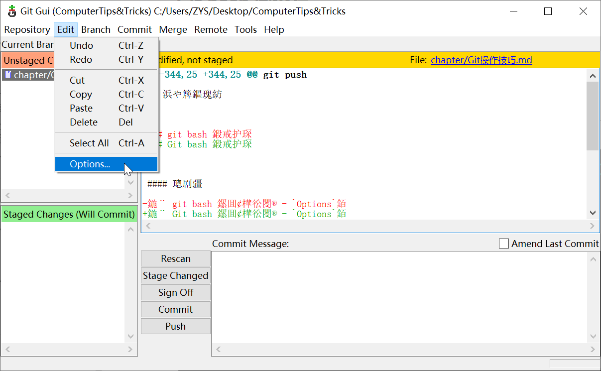
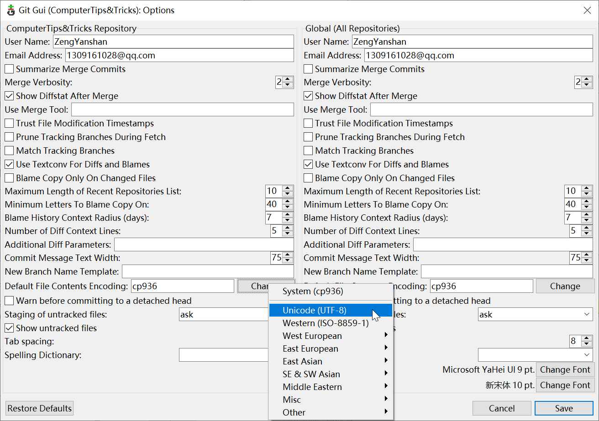
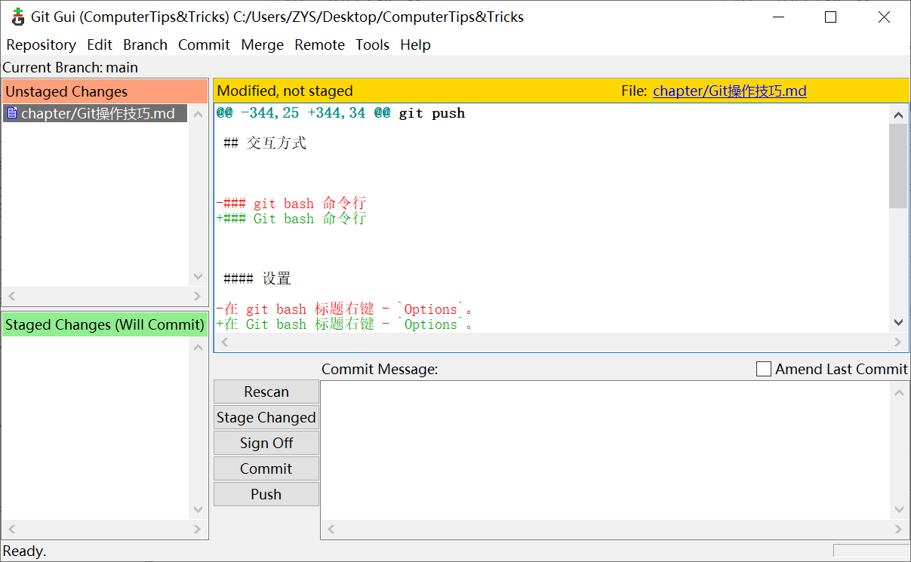

# Git 操作技巧


## 配置


#### 用户信息

##### 查看

```bash
git config user.name
git config user.email
```

##### 设置

```bash
# 仅当前仓库
git config user.name "ZengYanshan"
git config user.email "1309161028@qq.com"
# 全局
git config --global user.name "ZengYanshan"
git config --global user.email "1309161028@qq.com"
```


#### 代理

##### 设置代理

```bash
git config --global http.proxy http://127.0.0.1:7890
```

`7890`：Clash 的默认端口

##### 取消代理

```bash
git config --global --unset http.proxy
```

##### 查看代理

```bash
git config --global --get http.proxy
```


## 版本控制


### 本地

#### 创建仓库

```bash
git init
```

#### 暂存

```bash
# 单个文件
git add READMD.md
# 目录下文件
git add folder
# 所有文件
git add .
```

#### 提交

##### 提交

```bash
git commit # 之后会进入提交信息文本编辑
git commit -m "Story 182: Fix benchmarks for speed"
```

##### 撤销提交

```bash
# --soft：撤销提交，文件恢复到提交前状态（包括暂存）
git reset --soft HEAD^ # git bash / powershell
git reset --soft HEAD^^ # cmd 中的换行符默认为 ^ ，需要转义
# 查看帮助
git reset -h
```

#### 导出 zip

```bash
git archive --format=zip --output="filename.zip" branch-name
```


### .gitignore

`.gitignore` 文件中指定的项不会加入版本控制

```bash
# 单个文件
.gitignore
# 文件夹，也可以写作 /.vscode/
.vscode/
# 使用通配符忽略所有符合条件的文件
*.apk
```


## 远程仓库


### 基本操作


#### 本地关联

##### 克隆

```bash
git clone https://github.com/xxx/yyy.git
```

##### 查看

```bash
# 查看远程仓库URL
git remote -v
```

##### 修改/重设

```bash
git remote set-url origin https://github.com/xxx/yyy.git
```

##### 增加

```bash
git remote add origin https://github.com/xxx/yyy.git
```


#### 分支

##### 本地创建

```bash
git branch new-branch-name
```

##### 查看

```bash
# 查看本地分支
git branch
# 查看所有分支
git branch -a
```

##### 切换

```bash
git checkout branch-name
```

##### 合并

```bash
git merge branch-name
```


#### 推送

```bash
git push
```


### 常用组合操作


#### 已有本地仓库，创建远程仓库

> 在 `Github` 等的空仓库网页中可以找到以下所有命令

##### 1. 在网页上手动新建远程仓库

##### 2. 将本地仓库关联到远程仓库

```bash
git remote add origin https://github.com/xxx/yyy.git
```

##### 3. 将本地仓库上传到远程仓库

```bash
git push --set-upstream origin master
git push -u origin main
```

##### 4. 在另一台设备克隆远程仓库

```bash
git clone https://github.com/xxx/yyy.git
```


#### 已有远程仓库分支，拉取到本地创建新分支

##### 1. 获取远程仓库更新情况

```bash
git fetch
```

查看已记录到本地的分支

```bash
git branch -a
```

##### 2. 在本地创建同名新分支

```bash
git checkout new-branch # 自动跟踪同名远程分支
git checkout -b new-branch origin/new-branch
```


#### 本地创建分支，在远程也创建并推送到对应分支

##### 1. 本地创建分支

```bash
git branch new-branch-name
```

##### 2. 本地切换分支

工作区不会变，已修改未暂存、已修改已暂存的文件都在。

```bash
git checkout new-branch-name
```

用以下代码查看所有分支。当前分支会以 `*` 标出。

```bash
git branch -a
```

##### 3. 创建并推送到远程分支

```bash
git push origin new-branch-name:new-branch-name
```

##### 4. 后续修改推送到远程分支

```bash
git push --set-upstream origin new-branch-name
```


#### 分支合并

##### 1. 切换到主分支

```bash
git checkout main-branch-name
```

##### 2. 合并分支

```bash
git merge dev-branch-name
```

##### 3. 同步到远程仓库

```bash
git push
```


#### 上传大文件（超过100MB）

##### 0. 安装 Git LFS

略

##### 1. 使用 Git LFS 跟踪大文件

```bash
git lfs track "path/to/large-file"
```

控制台显示：

```
Tracking "path/to/large-file"
```

##### 2. 现在可以像普通文件一样正常 add, commit, push 了

```bash
git add "path/to/large-file"
git commit -m "commit message"
git push
```

## 交互方式


### Git bash 命令行


#### 设置

在 Git bash 标题右键 - `Options`。



在 `Keys` 选项中可以调节复制粘贴快捷键。取消勾选 `Shortcuts` - `Copy and Paste (Ctrl/Shift+Ins)` 后，复制粘贴改为 `Ctrl` + `Shift` + `C` / `V` 。




### Git GUI 界面


#### 基础功能

Git GUI 界面如下图所示。

主界面分为 4 块：

- `Unstaged Changes` ：左上，列出有更改的文件。点击可选中文件，在右侧显示内容。

- `Staged for commit` ：右上，显示选中文件更改内容，新增内容以绿色 `+` 标出，删减内容以红色 `-` 标出。

- `Staged Changes (Will Commit)` ：左下，列出已暂存更改的文件。点击文件可取消暂存，使其回到左上框中。

- 操作区：右下，提供 5 个按钮和 `Commit Message` 框。

    - Rescan：刷新

    - Stage Changed：暂存所有更改，相当于 `git add .` 

    - Sign Off：在提交信息末尾增加签名，极少用到

    - Commit：提交暂存的更改，信息为右侧 `Commit Message` 框中填写的内容，相当于 `git commit -m "Commit Message"` 

    - Push：推送到远程仓库，相当于 `git push` 




#### 设置

菜单栏 `Edit` - `Options` 。



在 `Default File Contents Encoding` 选项中可以修改编码，解决中文乱码问题。




