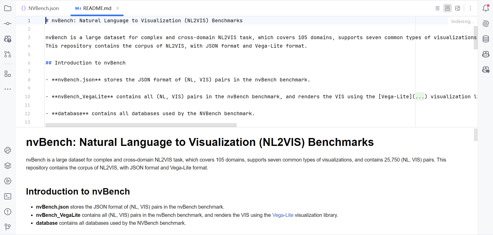
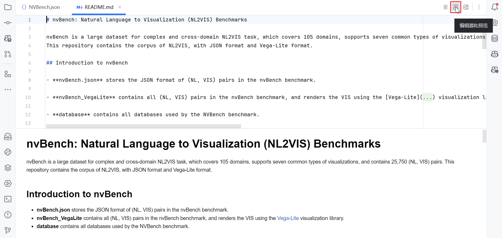
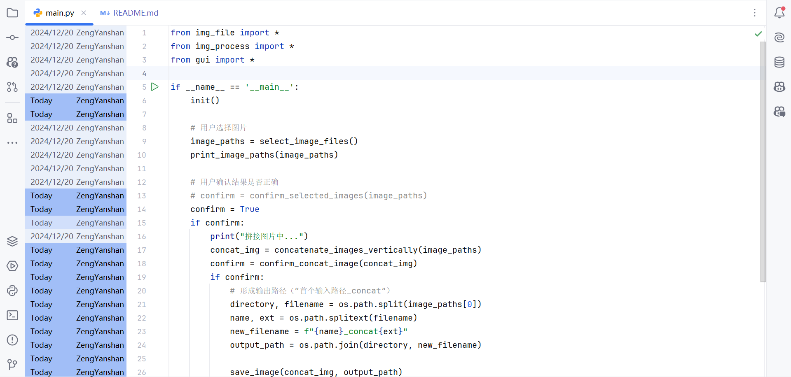
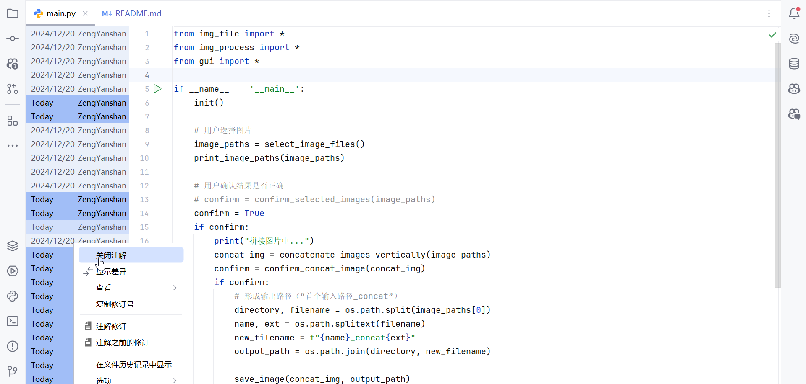
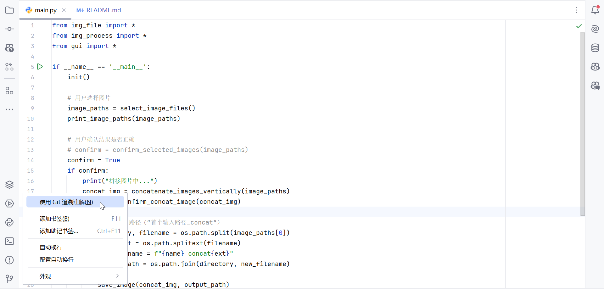

# JetBrain系（IDEA、PyCharm、AS）操作技巧

##### 查看源码

`Ctrl` + `鼠标左键`：跳转到对应声明或源码（跳转途经的文件不保留在菜单）

双击 `Shift`：查找，然后跳转到源码。可根据文件名查找。

##### 注释

`Ctrl` + `/` ：单行注释

##### 快捷代码

**Java**

`psvm` ：标准 Java main 函数

`.var` ：接收返回值

`sout` ：标准输出

`itit` ：迭代器循环

`foreach` ：foreach 循环

`stful` ：【AS】快速创建 `StatefulWidget` 及其对应 `State` 类

**Python**

`main` : Python main 函数

##### 递归创建目录

`parentDirectoryName.directoryName.fileName` ：新建文件

`grandparentDirectoryName/parentDirectoryName/directoryName` ：新建目录

> 若用类似新建文件的方法来新建目录，会新建一个名字带 `.` 的目录

##### 调整缩进

`Ctrl` + `Alt` + `L`：调整全文缩进

`Ctrl` + `Alt` + `I`：调整选中部分缩进

##### 批量改名

选中后 `shift` + `F6` ，输入新名后 `Enter`

### 常见问题

##### .java 文件图标左下角有橙色 j 且 main 函数不能运行

**解释：**未设置 `Source` 目录，IDEA无法识别

**解决：**
- 右键 `src` - `Mark Directory as` - `Sources Root`
- `file` - `Project Structure` - `Modules` - 右大栏 `Sources` - 单击 `src` - `Mark as` 单击 `Sources`

#### Spring Boot

##### `@Autowired` 报错但实际有 Java Bean

**解决：**

- `File` - `Settings` - `Editor` - `Inspections` - `Spring` - `Spring Code` - `Code`，找到对应项并调为 `Warning`

##### Markdown 代码&预览窗口变为上下排布

**解决：**

- 再点一下右上角的 `编辑器和预览` （英文为 `Editor and Preview` ）按钮

##### 行号栏左侧出现Git的修改记录

**解决：**

- 在左栏处右键 - `关闭注解`

- 如需打开，在行号栏处右键 - `使用 Git 追溯注解`

