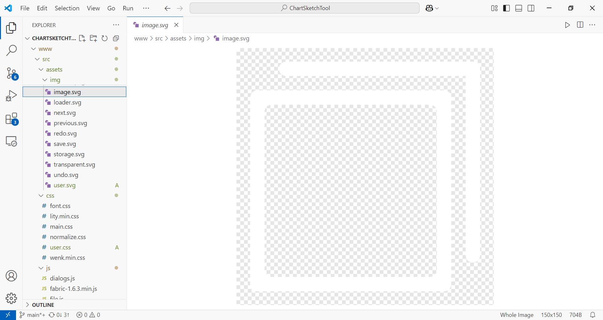
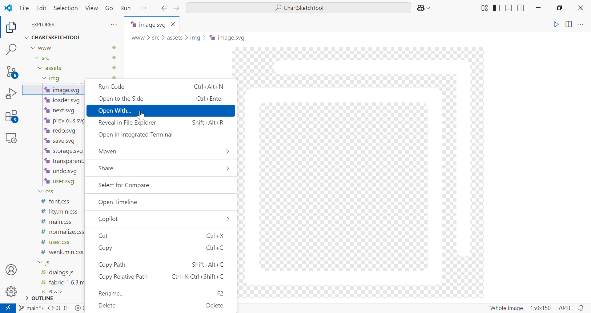
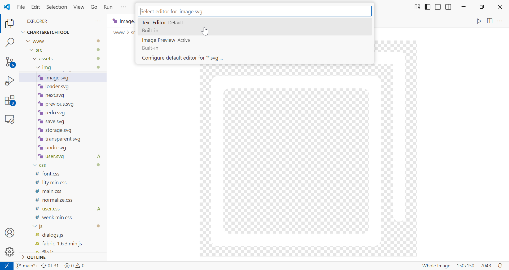
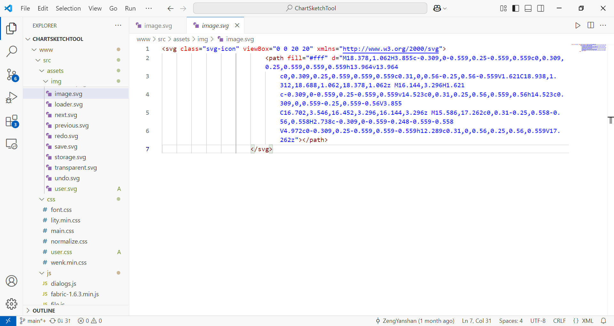
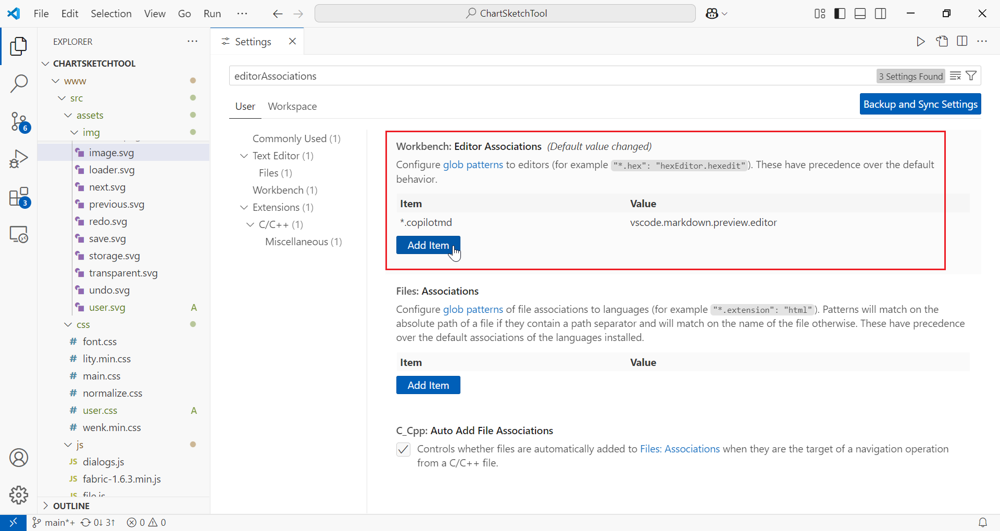
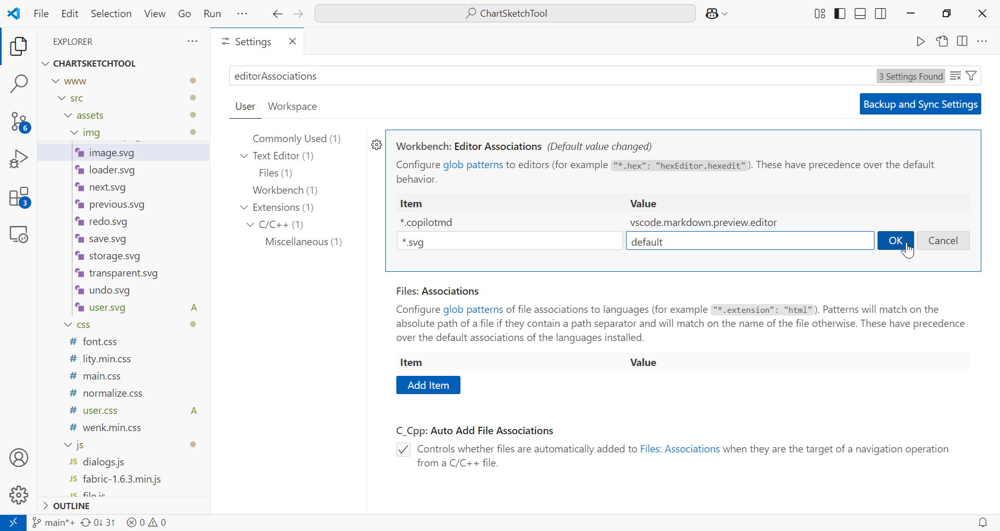

# VSCode 操作技巧


##### 调整代码格式

`Alt` + `Shift` + `F`

##### 复制整行

`Alt` + `Shift` + `Down`

该方法不占用剪贴板


### 常见问题

##### 打开 SVG 时显示为图像，而希望编辑源代码



**解释：**

在 1.97 版本以后，VSCode 默认以内置的图像预览方式打开 SVG 文件。

**解决：**

右键 SVG 文件 - `Open With...` - `Text Editor`







如果想要设置默认以文本编辑器打开 SVG ，打开设置，找到 `Workbench: Editor Associations` 项，点击 `Add Item` ，输入 `*.svg` 和 `default` 。





也可以打开设置 JSON 文件，加入以下内容：

```json
"workbench.editorAssociations": {
  "*.svg": "default"
}
```

